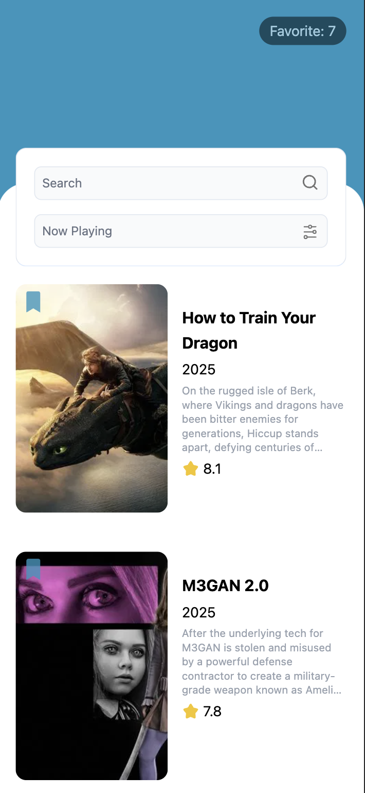
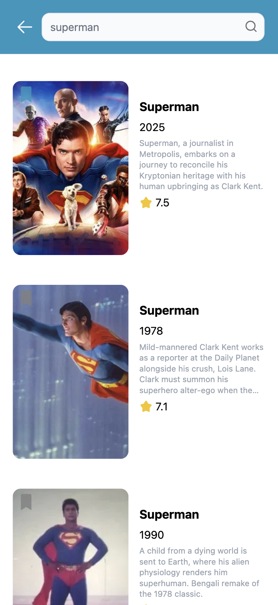
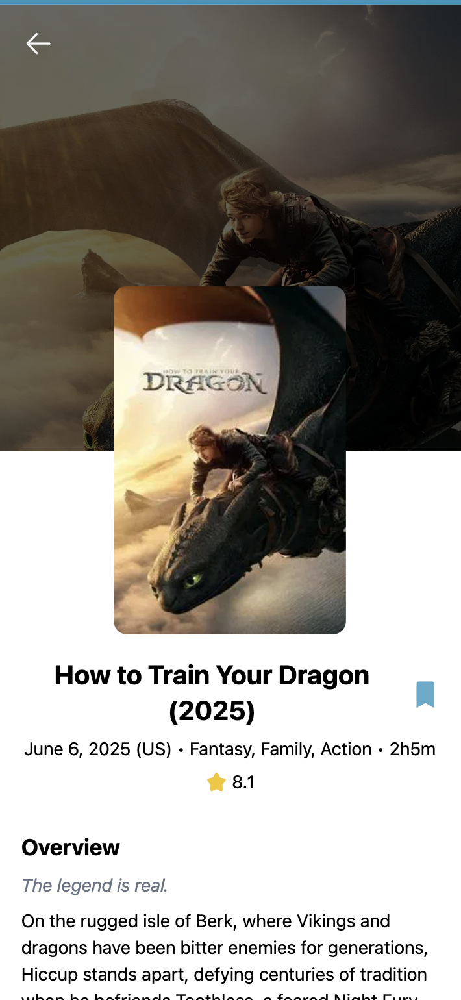
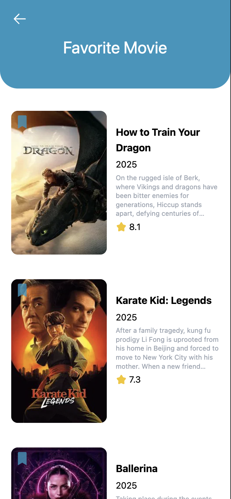

# Movie Show

This app show movie list, you can check detail for each moview, search for movie, and save your favorite movie. The data is provided by [Themoviedb](https://www.themoviedb.org/).

## Preview
| Home | Search | Detail | Favorite |
|------|--------|--------|----------|
|||||

## Build Setup
To run this project you need Node 22. In the project directory, you can run:

``` bash
# Runs next dev which starts Next.js in development mode
yarn dev

# Runs next lint which sets up Next.js' built-in ESLint configuration
yarn lint

# Runs next build which builds the application for production usage
yarn build
```

## Technologies
This project uses several technologies listed below :

- **[Vite](https://vite.dev/)**, blazing fast frontend build tool.
- **[Typescript](https://www.typescriptlang.org/)**, a strict syntactical superset of JavaScript and adds optional static typing to the language.
- **[Tailwindcss](https://tailwindcss.com/)**, rapidly build modern websites without ever leaving your HTML.
- **[React Context](https://reactjs.org/docs/context.html)**, context lets you “broadcast” such data, and changes to it, to all components below.
- **[Axios Hooks](https://www.npmjs.com/package/axios-hooks)**, React hooks for axios, with built-in support for server side rendering.
